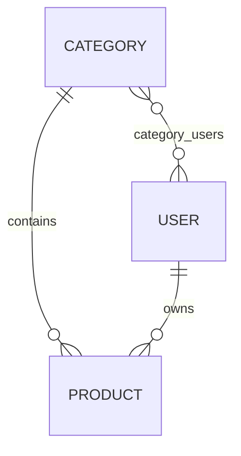

# GraphQL Product & Category

Bài tập Lập trình Web: xây dựng CRUD Category/Product bằng Spring for GraphQL, rồi render bằng Thymeleaf + jQuery AJAX.

## Yêu cầu và công nghệ

Yêu cầu gồm: danh sách Product theo giá tăng dần, Product theo Category, CRUD Product, CRUD Category và AJAX trên HTML. Ứng dụng dùng Java 21 (Maven hiện chạy JDK 24), Spring Boot 3.5.7, Spring GraphQL, Spring Web, Spring Data JPA, Jakarta Validation, Thymeleaf, Bootstrap, jQuery, Lombok, SQL Server JDBC và H2 chỉ cho test.

## Thiết kế dữ liệu



`products.category_id` được bổ sung vì quan hệ Category-Product một-nhiều bắt buộc cần khóa ngoại, dù đề gốc chưa liệt kê cột này. Cột SQL dùng `description` thay cho `desc` vì `DESC` là từ khóa SQL; GraphQL vẫn expose field `desc`.

## Cấu hình database

Tạo database (một lần, bằng tài khoản có quyền):

```sql
IF DB_ID(N'graphql_db') IS NULL CREATE DATABASE graphql_db;
```

Thiết lập biến môi trường trong phiên PowerShell, không ghi password vào source:

```powershell
$env:DB_USERNAME = "sa"
$env:DB_PASSWORD = "<your-password>"
```

Datasource mặc định là `localhost:1433/graphql_db`; có thể thay bằng `DB_HOST`, `DB_PORT`, `DB_NAME`, `DB_USERNAME`, `DB_PASSWORD`.

## Chạy và kiểm thử

```powershell
mvn clean test
mvn clean package
& "$env:JAVA_HOME\bin\java.exe" -jar ".\target\graphql-product-category-0.0.1-SNAPSHOT.jar"
```

- GraphQL: `http://localhost:8083/graphql` (POST)
- GraphiQL: `http://localhost:8083/graphiql`
- AJAX Category: `http://localhost:8083/ajax/categories`
- AJAX Product: `http://localhost:8083/ajax/products`

GraphQL có thể phản hồi HTTP 200 đồng thời chứa `errors`; client phải kiểm tra `errors` thay vì chỉ dựa HTTP status. Lỗi nghiệp vụ trả extension code `NOT_FOUND`, `CONFLICT` hoặc `VALIDATION_ERROR` mà không lộ stack trace/SQL/password.

### Query

`products`, `productById`, `productsByPriceAsc`, `productsByCategory`, `categories`, `categoryById`, `users`, `userById`.

```graphql
query ProductsByCategory($categoryId: ID!) {
  productsByCategory(categoryId: $categoryId) { id title price }
}
```

```json
{"categoryId":"1"}
```

### Mutation

`createCategory`, `updateCategory`, `deleteCategory`, `createProduct`, `updateProduct`, `deleteProduct`, `createUser`, `assignUsersToCategory`.

## Kế hoạch

- [x] Mục 1: nghiên cứu PDF, scaffold, thiết kế entity/repository/schema.
- [x] Mục 2: GraphQL service, resolver, validation, H2 GraphQlTester và SQL Server runtime.
- [x] Mục 3: hai trang Thymeleaf responsive, Bootstrap và jQuery AJAX render từ GraphQL.

Mục 2 dùng DTO input, service transaction, repository sorting ở database và `@EntityGraph` cho quan hệ Product-User-Category. Password User được BCrypt hash và schema không expose trường này.

Mục 3 có navigation giữa Category/Product, loading state, thông báo thành công/lỗi, xác nhận xóa và escape nội dung trước khi đưa vào bảng. Bộ lọc Category gọi `productsByCategory`; nút giá tăng dần gọi `productsByPriceAsc`, không tự sort bằng JavaScript.
