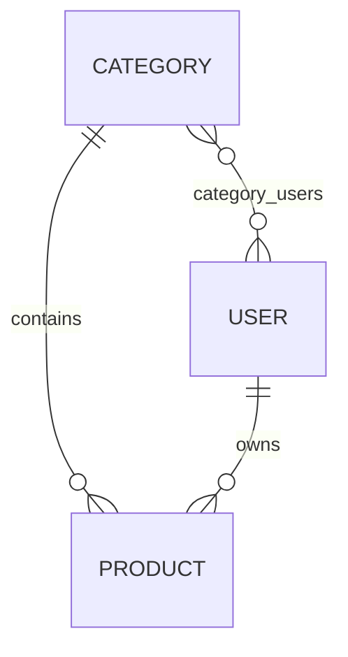

# GraphQL Product & Category

Bài tập Lập trình Web: xây dựng CRUD Category/Product bằng Spring for GraphQL, rồi render bằng Thymeleaf + jQuery AJAX.

## Yêu cầu và công nghệ

Yêu cầu gồm: danh sách Product theo giá tăng dần, Product theo Category, CRUD Product, CRUD Category và AJAX trên HTML. Ứng dụng dùng Java 21 (Maven hiện chạy JDK 24), Spring Boot 3.5.7, Spring GraphQL, Spring Web, Spring Data JPA, Jakarta Validation, Thymeleaf, Bootstrap, jQuery, Lombok, SQL Server JDBC và H2 chỉ cho test.

## Thiết kế dữ liệu



`products.category_id` được bổ sung vì quan hệ Category-Product một-nhiều bắt buộc cần khóa ngoại, dù đề gốc chưa liệt kê cột này. Cột SQL dùng `description` thay cho `desc` vì `DESC` là từ khóa SQL; GraphQL vẫn expose field `desc`.

## Cấu hình database

Tạo database (một lần, bằng tài khoản có quyền):

```sql
IF DB_ID(N'graphql_db') IS NULL CREATE DATABASE graphql_db;
```

Thiết lập biến môi trường trong phiên PowerShell, không ghi password vào source:

```powershell
$env:DB_USERNAME = "sa"
$env:DB_PASSWORD = "<your-password>"
```

Datasource mặc định là `localhost:1433/graphql_db`; có thể thay bằng `DB_HOST`, `DB_PORT`, `DB_NAME`, `DB_USERNAME`, `DB_PASSWORD`.

## Kế hoạch

- [x] Mục 1: nghiên cứu PDF, scaffold, thiết kế entity/repository/schema.
- [ ] Mục 2: hoàn thiện GraphQL service, resolver, validation và test thực.
- [ ] Mục 3: hoàn thiện hai trang AJAX và kiểm thử trình duyệt.

Ở cuối Mục 1, schema đã khai báo đầy đủ contract nhưng resolver nghiệp vụ, CRUD và giao diện chưa hoàn thành.
